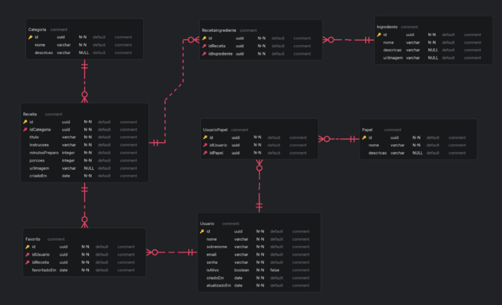

<h1>Funcionalidades finalizadas</h1>

<h1>Backend</h1>

1. Criação do DER

2. Criação de entidades e mapeamento para o banco de dados em Postgres

3. Autenticação e autorização de usuários baseado em JWT com cookies HTTP-Only.

4. Criação de endpoints fundamentais para gerenciamento de usuários (login, cadastro, tokens, etc)

5. Conteinerização da API utilizando Docker

<h1>Funcionalidades Pendentes</h1>

<h1>Backend</h1>

1. Criação de endpoints para todos os recursos no padrão REST

2. Publicação da API em um serviço gratuito

<h1>Frontend</h1>

1. Elaborar fluxo de autenticação

2. Criar tela principal

3. Criar tela de favoritos

4. Criar tela de busca com filtros
